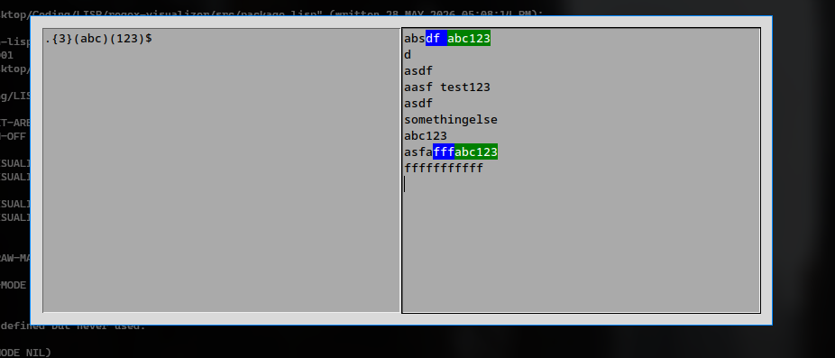

# regex-visualizer
Desktop Application to preview regex



## Dependencies

  - `maximilian-utils` (general utilities)
  - `cl-ppcre` (regex)
  - `tcl/tk` (graphics)
  - `ltk`  (lisp bindings for `tcl/tk`)

## Build/Install
  1. Ensure you have quicklisp and sbcl installed
  2. Clone and then run in project directory
  ```sh
  make all
  ./regex-visualizer
  ```

## License

  GPLv3

